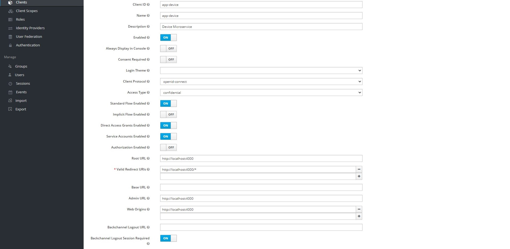
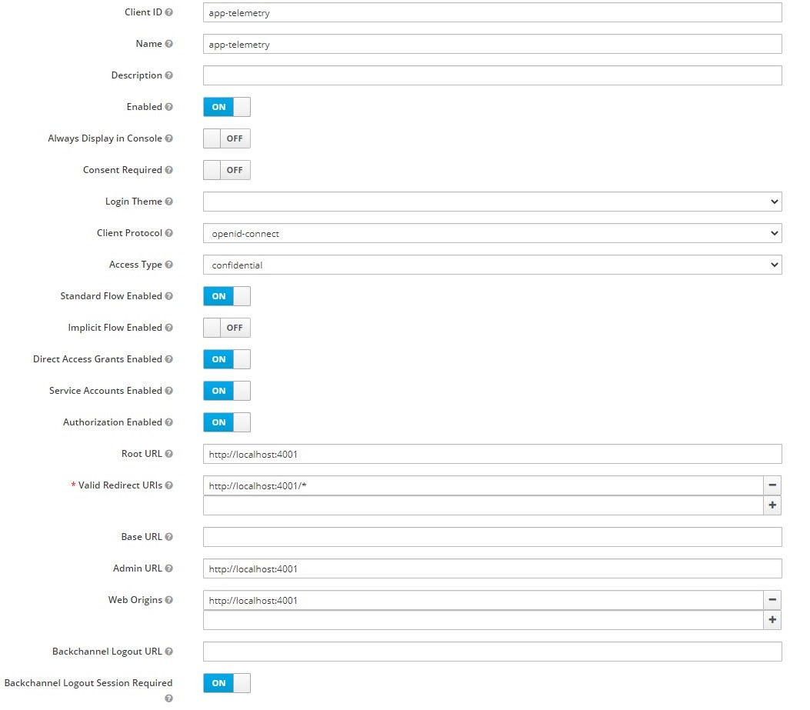
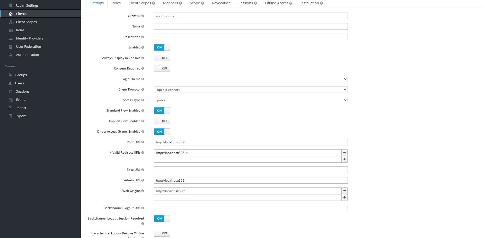

# Vue + Express + Keycloak

My attempt to integrate Vue with express secured with keycloak.

The goal of this little project is to create proof of concept to authenticate each backend confidential application independently with keycloak and make secure api calls between them.
In addition, frontend needs to be able to get data from backend apps using secure api calls.

## How to run

#### Keycloak setup

- You need to download keycloak from https://www.keycloak.org/downloads.html
- Start the keycloak server https://www.keycloak.org/docs/latest/getting_started/#starting-the-keycloak-server
- Setup keycloak admin account
- Create new realm
- for each app (We've got 3) you need to create keycloak client
  - app-device (confidential)
  - app-telemetry (confidential)
  - app-frontend (public)

### app-device

### app-telemetry

### app-frontend

To run **device** app you need to do

- npm install in device directory
- create database.json file with structure `{"devices": []}`
- create `.env` file
  - PORT (default 4000)
  - SESSION_SECRET
  - TELEMETRY_URL
  - KEYCLOAK_SERVER_URL
  - KEYCLOAK_CLIENT_ID
  - KEYCLOAK_SECRET
  - KEYCLOAK_REALM

start command: `npm start`

To run **telemetry** app you need to do

- npm install in telemetry directory
- create database.json file with structure `{"telemetries": []}`
- create `.env` file
  - PORT (default 4000)
  - SESSION_SECRET
  - KEYCLOAK_SERVER_URL
  - KEYCLOAK_CLIENT_ID
  - KEYCLOAK_SECRET
  - KEYCLOAK_REALM

start command: `npm start`

To run **frontend** app you need to do

- npm install in frontend directory
- create `.env` file
  - VUE_APP_KEYCLOAK_URL
  - VUE_APP_REALM
  - VUE_APP_CLIENT_ID

start command: `npm run serve`
