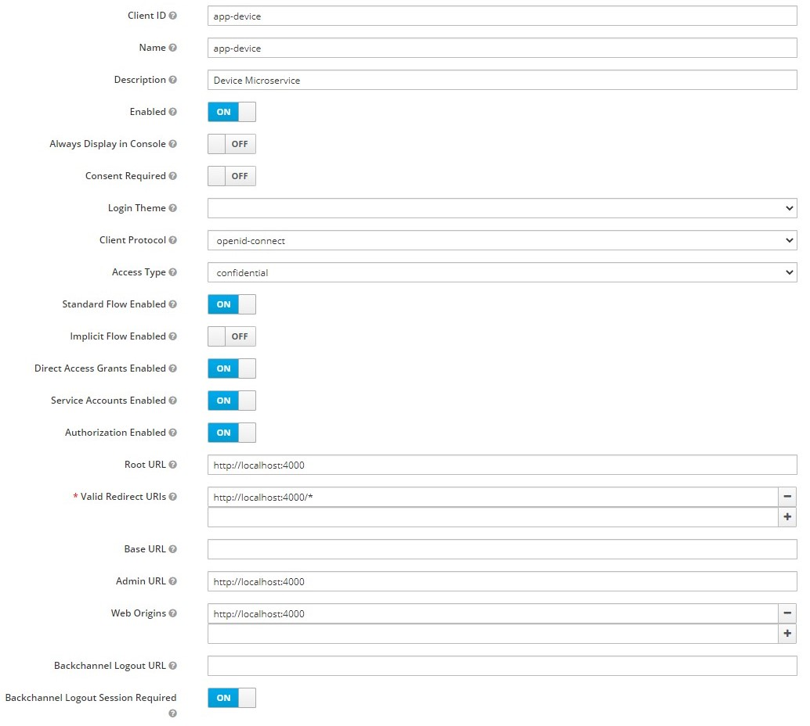

# Vue + Express + Keycloak

My attempt to integrate Vue with express secured with keycloak.

The goal of this little project was to authenticate each backend confidential application independently with keycloak and make secure api calls between them.
Also frontend needs to be able to get data from backend apps with secure api calls.

### How to run

#### Keycloak setup

- You need to download keycloak from https://www.keycloak.org/downloads.html
- Start the keycloak server https://www.keycloak.org/docs/latest/getting_started/#starting-the-keycloak-server
- Setup keycloak admin account
- Create new realm
- for each app (We've got 3) you need to create keycloak client
  - app-device (confidential)
  - app-telemetry (confidential)
  - app-frontend (public)

### app-device

### app-telemetry

### app-telemetry

